# École 42 in Paris

### What is École 42?

  &nbsp;&nbsp;&nbsp;&nbsp;<a href="https://42.fr/en/homepage/">École 42</a> in Paris, France is an innovative, tuition-free coding school that revolutionizes the way programming is taught. It offers a rigorous, project-based curriculum where students learn through hands-on experience and peer collaboration rather than traditional lectures or professors. The school is known for its unique "peer-to-peer" learning model, which fosters a self-driven, independent approach to problem-solving. Students must overcome obstacles, work long hours, and engage in continuous collaboration, pushing them to develop not only technical skills but also perseverance, adaptability, and teamwork, setting it apart from conventional programming schools.

### My 42 Journey

  &nbsp;&nbsp;&nbsp;&nbsp;I Started École 42 in Paris, France in August 2022 with the C picsine. After the 1 month long try-outs I was accepted into the school and started the common core in November 2022. I finished the common core in January 2025.

## Ecole 42 Projects - Listed in order from most recent to oldest

### Common Core / Tronc Commun

#### [ft_transcendence](https://github.com/Drewski6/ft_transcendence)

<ul>
  <li>Create a full stack multiplayer pong game that's playable over the internet.</li>
  <li><strong>Partner project</strong> Team size: <strong>3</strong></li>
  <li><strong>Time Spent</strong>: <strong>4 months</strong> (Oct 2024 - Jan 2025)</li>
  <li>
    <strong>Final Grade</strong>:
    
  </li>
  
Some Bonus Completed

</ul>

  
  
  
  
  
  
  

#### [Inception](https://github.com/Drewski6/inception)
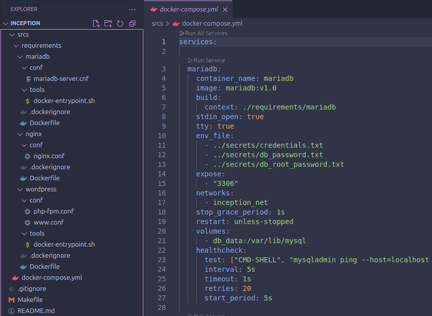
<ul>
  <li>Intro to DevOps. Deploy a WordPress based web application using Docker.</li>
  <li><strong>Solo Project</strong></li>
  <li><strong>Time Spent</strong>: <strong>2 months</strong> (Aug 2024 - Sep 2024)</li>
  <li>
    <strong>Final Grade</strong>:
    
  </li>
  
Bonus Not Completed

</ul>

  
  
  
  
  
  

#### [ft_irc](https://github.com/Drewski6/ft_irc)
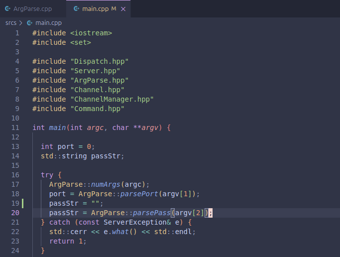
<ul>
  <li>Create your own IRC (Internet Relay Chat) server in C++.</li>
  <li><strong>Partner project</strong> Team size: <strong>2</strong></li>
  <li><strong>Time Spent</strong>: <strong>2 months</strong> (May 2024 - Jul 2024)</li>
  <li>
    <strong>Final Grade</strong>:
    
  </li>
  
Completed Some Bonus

</ul>

  
  
  

#### [C++ Modules](https://github.com/Drewski6/cpp) (10 in total)
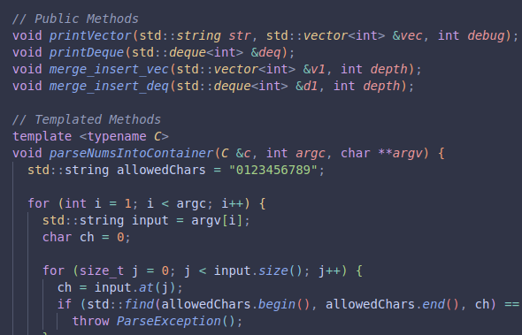
<ul>
  <li>Intro to object-oriented programming with the best place to start: <strong>C++98</strong>.</li>
  <li><strong>Solo Project</strong></li>
  <li><strong>Time Spent</strong>: <strong>4 months</strong> (Jan 2024 - May 2024)</li>
  <li>
    <strong>Final Grade</strong>:
    
  </li>
  
Bonus Not Available

</ul>

  
  
  

#### [cub3d](https://github.com/Drewski6/cub3d)

<ul>
  <li>Final C project. Create a graphics engine like the one used in Doom or Wolfenstein 3D.</li>
  <li><strong>Partner Project</strong> Team size: <strong>2</strong></li>
  <li><strong>Time Spent</strong>: <strong>1 month</strong> (Nov 2023 - Dec 2023)</li>
  <li>
    <strong>Final Grade</strong>:
    
  </li>
  
Completed Some Bonus

</ul>

  
  
  

#### [NetPractice](https://github.com/Drewski6/NetPractice)
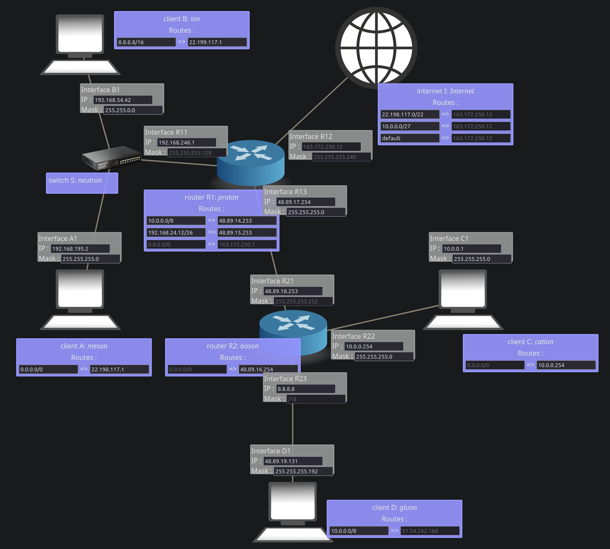
<ul>
  <li>Intro to networking. Understanding the IP protocol.</li>
  <li><strong>Solo Project</strong></li>
  <li><strong>Time Spent</strong>: <strong>2 weeks</strong> (Oct 2023 - Nov 2023)</li>
  <li>
    <strong>Final Grade</strong>:
    
  </li>
  
Bonus Not Available

</ul>

  

#### [Philosophers](https://github.com/Drewski6/philosophers)
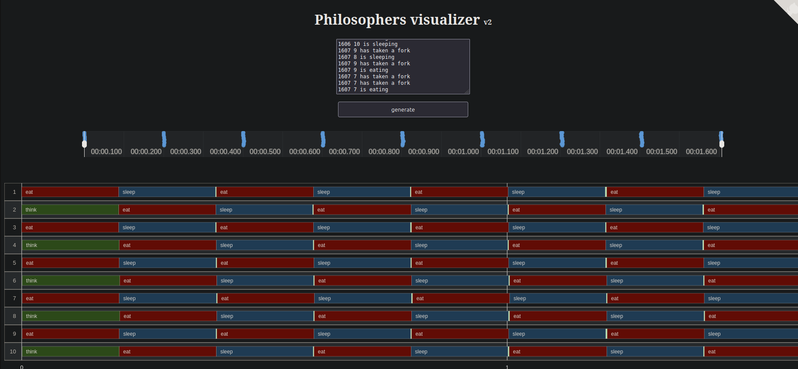
<ul>
  <li>Multithreading and concurrency. Solve the <a href="https://en.wikipedia.org/wiki/Dining_philosophers_problem">dining philosophers</a> problem using threads and mutexes in C.</li>
  <li><strong>Solo Project</strong></li>
  <li><strong>Time Spent</strong>: <strong>1 month</strong> (Oct 2023)</li>
  <li>
    <strong>Final Grade</strong>:
    
  </li>
  
Bonus Not Completed

</ul>

  
  
  

#### [MiniShell](https://github.com/Drewski6/minishell)
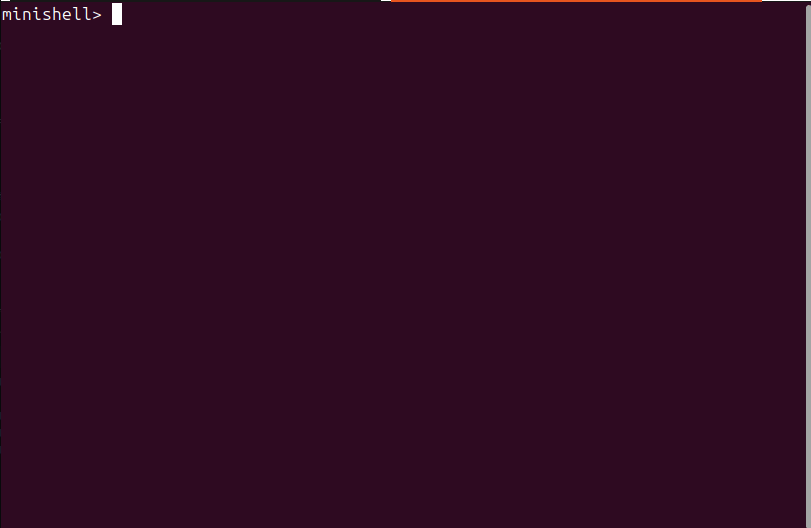
<ul>
  <li>Make your own shell (like sh, bash, zsh, etc) in C.</li>
  <li><strong>Partner project</strong> Team size: <strong>2</strong></li>
  <li><strong>Time Spent</strong>: <strong>3 months</strong> (Jul 2023 - Oct 2023)</li>
  <li>
    <strong>Final Grade</strong>:
    
  </li>
  
Completed Some Bonus

</ul>

  
  
  

#### [FdF](https://github.com/Drewski6/FdF) (Fil de Fer / Wireframe Model)
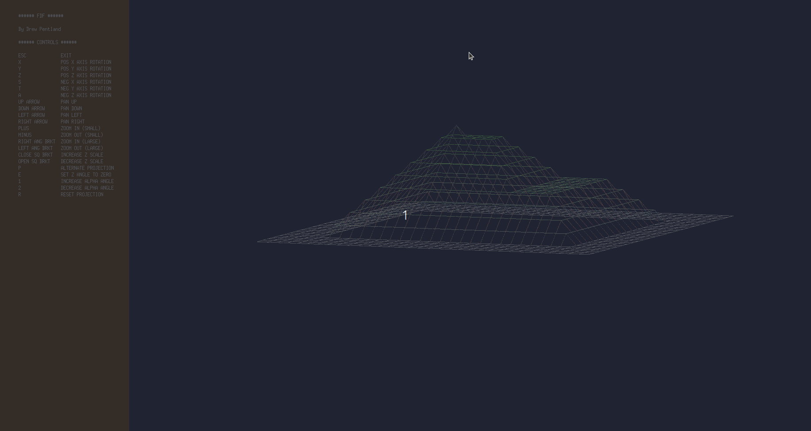
<ul>
  <li>Intro to graphics. Create a 3D wireframe map based on an input file in C.</li>
  <li><strong>Solo Project</strong></li>
  <li><strong>Time Spent</strong>: <strong>1 month</strong> (May 2023 - Jun 2023)</li>
  <li>
    <strong>Final Grade</strong>:
    
  </li>
  
Completed ALL Bonus

</ul>

  
  
  

#### [Pipex](https://github.com/Drewski6/pipex)
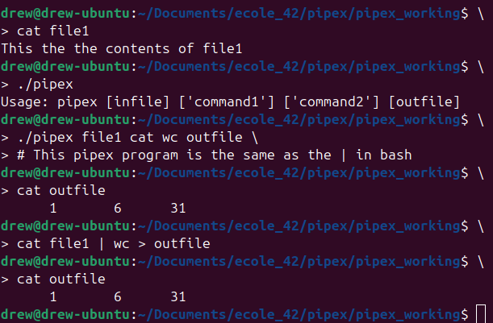
<ul>
  <li>Recreate the pipe from the command line in C.</li>
  <li><strong>Solo Project</strong></li>
  <li><strong>Time Spent</strong>: <strong>1 month</strong> (Apr 2023 - May 2023)</li>
  <li>
    <strong>Final Grade</strong>:
    
  </li>
  
Completed ALL Bonus

</ul>

  
  
  

#### [Push_Swap](https://github.com/Drewski6/push_swap)
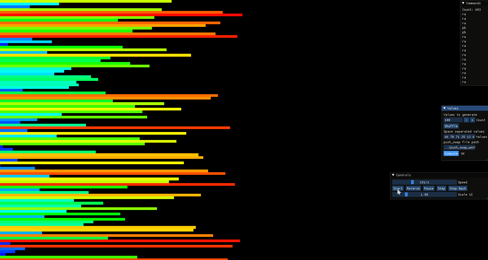
<ul>
  <li>Introduction to algorithms. Create a specific sorting algorithm in C.</li>
  <li><strong>Solo Project</strong></li>
  <li><strong>Time Spent</strong>: <strong>1 month</strong> (Apr 2023)</li>
  <li>
    <strong>Final Grade</strong>:
    
  </li>
  
Completed ALL Bonus

</ul>

  
  
  

#### [Born2beroot](https://github.com/Drewski6/Born2beRoot)
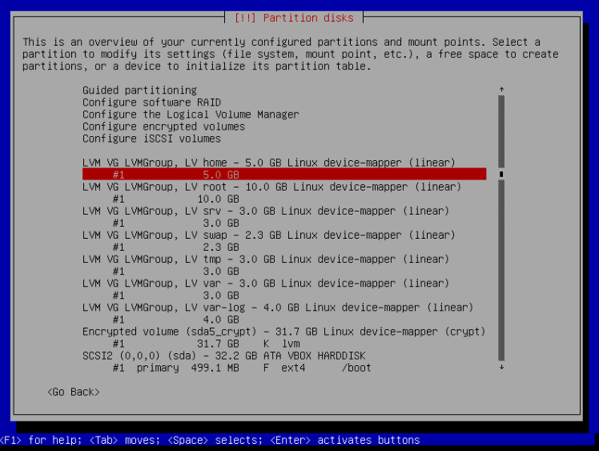
<ul>
  <li>Introduction to system administration. Set up a virtual machine for use as a web and FTP (file transfer protocol) server.</li>
  <li><strong>Solo Project</strong></li>
  <li><strong>Time Spent</strong>: <strong>1 month</strong> (Mar 2023 - Apr 2023)</li>
  <li>
    <strong>Final Grade</strong>:
    
  </li>
  
Completed ALL Bonus

</ul>

  
  
  

#### [ft_printf](https://github.com/Drewski6/ft_printf)
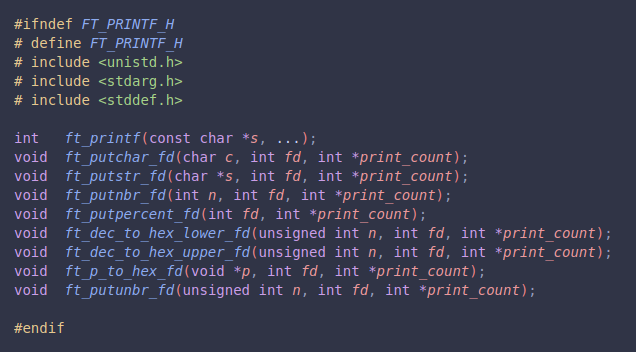
<ul>
  <li>Recreate printf from the C Standard Library in C.</li>
  <li><strong>Solo Project</strong></li>
  <li><strong>Time Spent</strong>: <strong>1 month</strong> (Jan 2023 - Feb 2023)</li>
  <li>
    <strong>Final Grade</strong>:
    
  </li>
  
Completed Some Bonus

</ul>

  
  
  

#### [get_next_line](https://github.com/Drewski6/get_next_line)
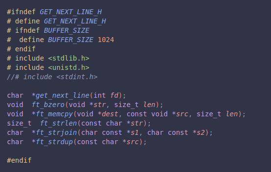
<ul>
  <li>Create a function to get the next line (up to \n) from a file descriptor.</li>
  <li><strong>Solo Project</strong></li>
  <li><strong>Time Spent</strong>: <strong>1 month</strong> (Dec 2022 - Jan 2023)</li>
  <li>
    <strong>Final Grade</strong>:
    
  </li>
  
Completed ALL Bonus

</ul>

  
  
  

#### [Libft](https://github.com/Drewski6/Libft)
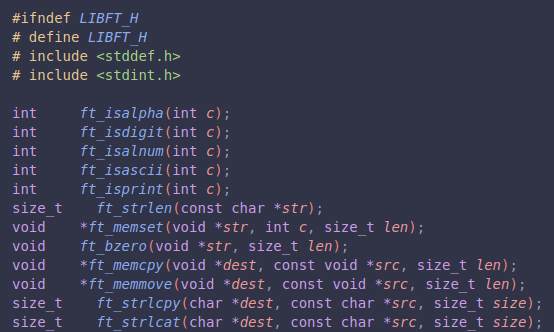
<ul>
  <li>At École 42, we aren't allowed to use the C Standard Library, so we have to make our own!</li>
  <li><strong>Solo Project</strong></li>
  <li><strong>Time Spent</strong>: <strong>1 month</strong> (Nov 2022 - Dec 2022)</li>
  <li>
    <strong>Final Grade</strong>:
    
  </li>
  
Completed ALL Bonus

</ul>

  
  
  

### C Piscine

#### [C Piscine](https://github.com/Drewski6/C_Piscine) (Tryouts to get into the school)
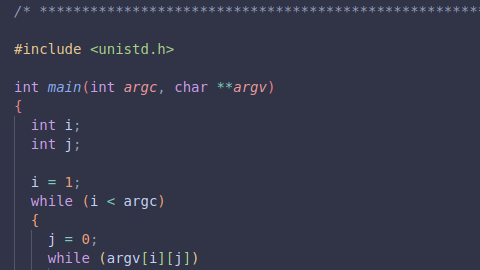
<ul>
  <li>Daily Linux-based C coding challenges for beginners as an introduction to computer science.</li>
  <li><strong>Solo Projects</strong> with high emphasis on <strong>working collaboratively</strong> with other tryout participants.</li>
  <li><strong>Time Spent</strong>: <strong>4 weeks</strong> (Aug 2022)</li>
  <li>
    <strong>Final Result</strong>:
    
  </li>
</ul>

  
  
  

