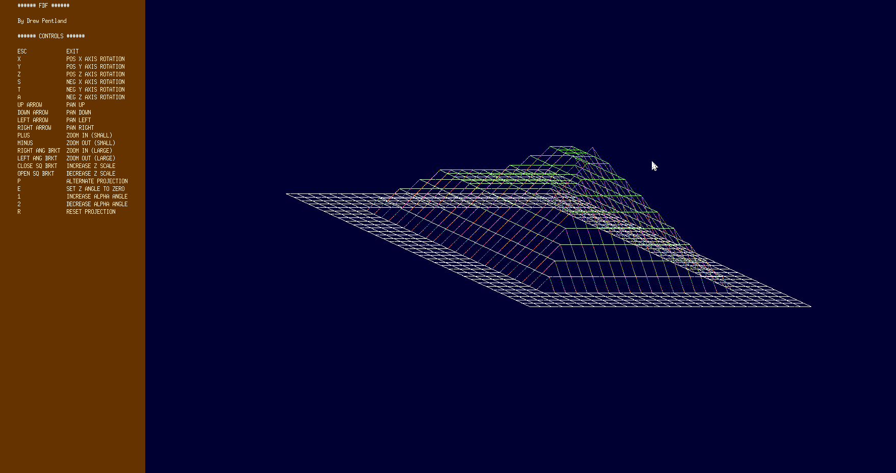

# Ecole-42-Paris

### What is Ecole 42?

  &nbsp;&nbsp;&nbsp;&nbsp;École 42 in Paris is an innovative, tuition-free coding school that revolutionizes the way programming is taught. It offers a rigorous, project-based curriculum where students learn through hands-on experience and peer collaboration rather than traditional lectures or professors. The school is known for its unique "peer-to-peer" learning model, which fosters a self-driven, independent approach to problem-solving. Students must overcome obstacles, work long hours, and engage in continuous collaboration, pushing them to develop not only technical skills but also perseverance, adaptability, and teamwork, setting it apart from conventional programming schools.

### About Me

  &nbsp;&nbsp;&nbsp;&nbsp;I Started Ecole 42 in Paris, France in August 2022 with the C Picsine. After the 1 month long try-outs I was accepted into the school and started the common core in November 2022. I finished the common core in January 2025.

## Ecole 42 Projects - Listed in order from most recent to oldest

<table>
  <tr>
    <th>Common Core / Tronc Commun</th>
  </tr>
  
  <tr>
    <td></td>
    <td>
      <strong><a href="https://github.com/Drewski6/ft_transcendence">ft_transcendence</a></strong> 
      <ul>
        <li>Create a full stack multiplayer pong game that's playable over the internet.</li>
        <li><strong>Partner project</strong> Team size: <strong>3</strong></li>
        <li>Time spent: October 2024 to January 2025 (4 months)</li>
        <li><strong>Final Grade</strong>: $${\color{lightgreen}118 / 100}$$ (Completed Some Bonus)</li>
      </ul>
      

        
        
        
        
        
        
        
      

    </td>
  </tr>
  
  <tr>
    <td></td>
    <td>
      <strong><a href="https://github.com/Drewski6/inception">Inception</a></strong> 
      <ul>
        <li>Intro to DevOps. Deploy a full stack application using Docker.</li>
        <li><strong>Solo Project</strong></li>
        <li>Time spent: August 2024 to September 2024 (2 months including vacations)</li>
        <li><strong>Final Grade</strong>: $${\color{lightgreen}100 / 100}$$ (Bonus Not Completed)</li>
      </ul>
      

        
        
        
        
        
        
        

      </td>
  </tr>
  
  <tr>
    <td></td>
    <td>
      <strong><a href="https://github.com/Drewski6/ft_irc">ft_irc</a></strong> 
      <ul>
        <li>Create your own IRC (Internet Relay Chat) server.</li>
        <li><strong>Partner project</strong> Team size: <strong>2</strong></li>
        <li>Time spent: End May 2024 to End July 2024 (2 months)</li>
        <li><strong>Final Grade</strong>: $${\color{lightgreen}115 / 100}$$ (Completed Some Bonus)</li>
      </ul>
      

        
        
        
      

    </td>
  </tr>
  
  <tr>
    <td></td>
    <td>
      <strong><a href="https://github.com/Drewski6/cpp">C++ Modules</a> (10 in total)</strong> 
      <ul>
        <li>Intro to object-oriented programming.</li>
        <li><strong>Solo Project</strong></li>
        <li>Time spent: End January 2024 to End May 2024 (4 months)</li>
        <li><strong>Final Grade</strong>: $${\color{lightgreen}100 / 100}$$ (Bonus Not Available)</li>
      </ul>
      

        
        
        
      

    </td>
  </tr>

  <tr>
    <td></td>
    <td>
      <strong><a href="https://github.com/Drewski6/cub3d">cub3d</a></strong> 
      <ul>
        <li>Final C project. Create a graphics engine like the one used in Doom or Wolfenstein 3D.</li>
        <li><strong>Partner Project</strong> Team size: <strong>2</strong></li>
        <li>Time spent: Mid November 2023 to Mid December 2023 (1 month)</li>
        <li><strong>Final Grade</strong>: $${\color{lightgreen}105 / 100}$$ (Completed Some Bonus)</li>
      </ul>
      

        
        
        
      

    </td>
  </tr>

  <tr>
    <td></td>
    <td>
      <strong><a href="https://github.com/Drewski6/NetPractice">NetPractice</a></strong> 
      <ul>
        <li>Intro to networking. Understanding the IP protocol.</li>
        <li><strong>Solo Project</strong></li>
        <li>Time spent: End October 2023 to Mid November 2023 (2 weeks)</li>
        <li><strong>Final Grade</strong>: $${\color{lightgreen}100 / 100}$$ (Bonus Not Available)</li>
      </ul>
      

        
      

    </td>
  </tr>

  <tr>
    <td></td>
    <td>
      <strong><a href="https://github.com/Drewski6/philosophers">Philosophers</a></strong> 
      <ul>
        <li>Solve the dining philosophers problem using threads and mutexes.</li>
        <li><strong>Solo Project</strong></li>
        <li>Time spent: Beginning October 2023 to End October 2023 (~ 1 month)</li>
        <li><strong>Final Grade</strong>: $${\color{lightgreen}100 / 100}$$ (Bonus Not Completed)</li>
      </ul>
      

        
        
        
      

    </td>
  </tr>

  <tr>
    <td></td>
    <td>
      <strong><a href="https://github.com/Drewski6/minishell">MiniShell</a></strong> 
      <ul>
        <li>Make your own shell (sh, bash, zsh, etc).</li>
        <li><strong>Partner project</strong> Team size: <strong>2</strong></li>
        <li>Time spent: End July 2023 to Beginning October 2023 (~ 3 months including vacations)</li>
        <li><strong>Final Grade</strong>: $${\color{lightgreen}110 / 100}$$ (Completed Some Bonus)</li>
      </ul>
      

        
        
        
      

    </td>
  </tr>

  <tr>
    <td></td>
    <td>
      <strong><a href="https://github.com/Drewski6/FdF">FdF</a> (Fil de Fer / Wireframe Model)</strong> 
      <ul>
        <li>Intro to graphics. Create a 3D wireframe map based on an input file.</li>
        <li><strong>Solo Project</strong></li>
        <li>Time spent: May 2023 to June 2023 (1 month)</li>
        <li><strong>Final Grade</strong>: $${\color{lightgreen}125 / 100}$$ (Completed ALL Bonus)</li>
      </ul>
      

        
        
        
      

    </td>
  </tr>

  <tr>
    <td></td>
    <td>
      <strong><a href="https://github.com/Drewski6/pipex">Pipex</a></strong> 
      <ul>
        <li>Recreate the pipe from the command line in C.</li>
        <li><strong>Solo Project</strong></li>
        <li>Time spent: End April 2023 to May 2023 (1 month)</li>
        <li><strong>Final Grade</strong>: $${\color{lightgreen}125 / 100}$$ (Completed ALL Bonus)</li>
      </ul>
      

        
        
        
      

    </td>
  </tr>

  <tr>
    <td></td>
    <td>
      <strong><a href="https://github.com/Drewski6/push_swap">Push_Swap</a></strong> 
      <ul>
        <li>Introduction to algorithms. Create a specific sorting algorithm in C.</li>
        <li><strong>Solo Project</strong></li>
        <li>Time spent: Beginning April 2023 to End April 2023 (~ 1 month)</li>
        <li><strong>Final Grade</strong>: $${\color{lightgreen}125 / 100}$$ (Completed ALL Bonus)</li>
      </ul>
      

        
        
        
      

    </td>
  </tr>

  <tr>
    <td></td>
    <td>
      <strong><a href="https://github.com/Drewski6/Born2beRoot">Born2beroot</a></strong> 
      <ul>
        <li>Introduction to system administration. Set up a virtual machine for use as a server.</li>
        <li><strong>Solo Project</strong></li>
        <li>Time spent: March 2023 to April 2023 (1 month)</li>
        <li><strong>Final Grade</strong>: $${\color{lightgreen}125 / 100}$$ (Completed ALL Bonus)</li>
      </ul>
      

        
        
        
      

    </td>
  </tr>

  <tr>
    <td></td>
    <td>
      <strong><a href="https://github.com/Drewski6/ft_printf">ft_printf</a></strong> 
      <ul>
        <li>Recreate our own printf in C.</li>
        <li><strong>Solo Project</strong></li>
        <li>Time spent: January 2023 to February 2023 (1 month)</li>
        <li><strong>Final Grade</strong>: $${\color{lightgreen}122 / 100}$$ (Completed Some Bonus)</li>
      </ul>
      

        
        
        
      

    </td>
  </tr>

  <tr>
    <td></td>
    <td>
      <strong><a href="https://github.com/Drewski6/get_next_line">get_next_line</a></strong> 
      <ul>
        <li>Create a function to get the next line (up to \n) from a file descriptor.</li>
        <li><strong>Solo Project</strong></li>
        <li>Time spent: December 2022 to January 2023 (1 month)</li>
        <li><strong>Final Grade</strong>: $${\color{lightgreen}125 / 100}$$ (Completed ALL Bonus)</li>
      </ul>
      

        
        
        
      

    </td>
  </tr>

  <tr>
    <td></td>
    <td>
      <strong><a href="https://github.com/Drewski6/Libft">Libft</a></strong> 
      <ul>
        <li>We aren't allowed to use the C Standard Library, so we have to make our own!</li>
        <li><strong>Solo Project</strong></li>
        <li>Time spent: November 2022 to December 2022 (1 month)</li>
        <li><strong>Final Grade</strong>: $${\color{lightgreen}125 / 100}$$ (Completed ALL Bonus)</li>
      </ul>
      

        
        
        
      

    </td>
  </tr>

  <tr>
    <th>C Piscine</th>
    <th></th>
  </tr>

  <tr>
    <td></td>
    <td>
      <strong><a href="https://github.com/Drewski6/C_Piscine">C Piscine</a> (Tryouts to get into the school)</strong> 
      <ul>
        <li>Daily Linux-based C coding challenges for beginners as an introduction to computer science.</li>
        <li><strong>Solo Projects</strong> with high emphasis on <strong>working collaboratively</strong> with other tryout participants</li>
        <li>Time spent: August 2022 (every day for 4 weeks)</li>
        <li><strong>Final Result</strong>: $${\color{lightgreen}Accepted}$$ and admitted as full-time student!</li>
      </ul>
      

        
        
        
      

    </td>
  </tr>

</table>